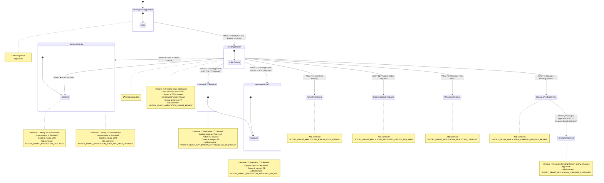

```mermaid
stateDiagram-v2
    [*] --> PendingGrantApplication
    state PendingGrantApplication {
        [*] --> Initial
    }
    note right of PendingGrantApplication: 📝 Pending Grant Application

    PendingGrantApplication --> GrantApplication: When "👀 Ready For ZCG Review" is added
    state GrantApplication {
        [*] --> UnderReview
    }
    note right of GrantApplication: 📋 Grant Application
    note right of GrantApplication
        - Remove "📝 Pending Grant Application"
        - Add "📋 Grant Application"
        - Assign to ZCG reviewer
        - Set status to "Under Review"
        - Create & merge a PR
        - Add comment: "NOTIFY_GRANT_APPLICATION_UNDER_REVIEW"
    end note

    GrantApplication --> ApprovedKYCRequired: When "✅ Grant Approved" AND "🔐 KYC Required"
    state ApprovedKYCRequired {
        [*] --> Approved
    }
    note right of ApprovedKYCRequired
        - Remove "👀 Ready For ZCG Review"
        - Update status to "Approved"
        - Note KYC required
        - Create & merge a PR
        - Add comment: "NOTIFY_GRANT_APPLICATION_APPROVED_KYC_REQUIRED"
    end note

    GrantApplication --> ApprovedNoKYC: When "✅ Grant Approved" without "🔐 KYC Required"
    state ApprovedNoKYC {
        [*] --> Approved
    }
    note right of ApprovedNoKYC
        - Remove "👀 Ready For ZCG Review"
        - Update status to "Approved"
        - Create & merge a PR
        - Add comment: "NOTIFY_GRANT_APPLICATION_APPROVED_NO_KYC"
    end note

    GrantApplication --> Declined: When "❌ Grant Declined"
    note right of Declined
        - Remove "👀 Ready For ZCG Review"
        - Update status to "Declined"
        - Create & merge a PR
        - Add comment: "NOTIFY_GRANT_APPLICATION_DECLINED"
    end note

    GrantApplication --> DeclinedCriteria: When "⛔ Does Not Meet Criteria"
    state DeclinedCriteria {
        [*] --> Declined
    }
    note right of DeclinedCriteria
        - Remove "👀 Ready For ZCG Review"
        - Update status to "Declined"
        - Create & merge a PR
        - Add comment: "NOTIFY_GRANT_APPLICATION_DOES_NOT_MEET_CRITERIA"
    end note

    GrantApplication --> ForumPostMissing: When "📢 Forum Post Missing"
    note right of ForumPostMissing
        - Add comment: "NOTIFY_GRANT_APPLICATION_FORUM_POST_MISSING"
    end note

    GrantApplication --> ProgressUpdateRequired: When "📊 Progress Update Required"
    note right of ProgressUpdateRequired
        - Add comment: "NOTIFY_GRANT_APPLICATION_PROGRESS_UPDATE_REQUIRED"
    end note

    GrantApplication --> MilestonesPastDue: When "⏰ Milestones Past Due"
    note right of MilestonesPastDue
        - Add comment: "NOTIFY_GRANT_APPLICATION_MILESTONE_OVERDUE"
    end note

    GrantApplication --> ChangesPendingReview: When "🔄 Changes Pending Review"
    note right of ChangesPendingReview
        - Add comment: "NOTIFY_GRANT_APPLICATION_CHANGES_REQUIRE_REVIEW"
    end note

    ChangesPendingReview --> ChangesApproved: When "✔️ Changes Approved" AND "🔄 Changes Pending Review"
    note right of ChangesApproved
        - Remove "🔄 Changes Pending Review" and "✔️ Changes Approved"
        - Add comment: "NOTIFY_GRANT_APPLICATION_CHANGES_APPROVED"
    end note
```
